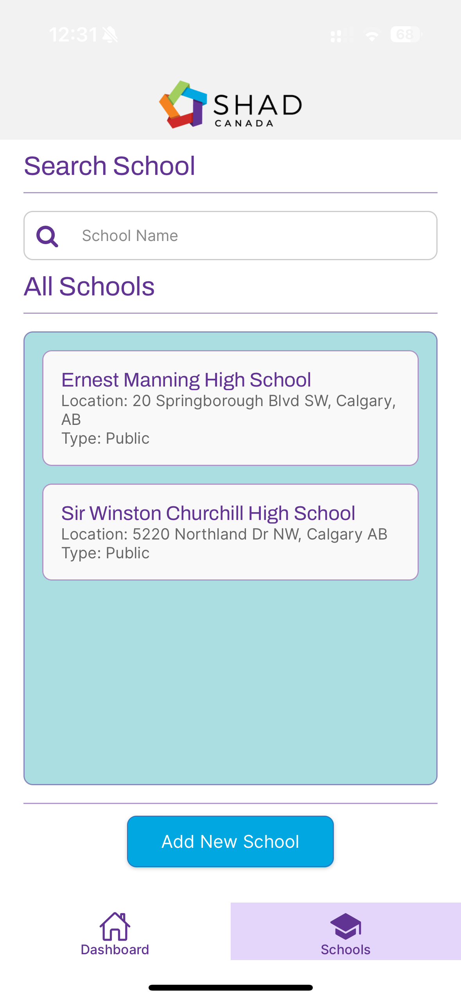

##  **Shad Canada Recruitment Management Application**  

Effortlessly manage recruitment efforts for the program with this fullstack solution. Track school visits, schedule updates, and monitor progress — all in one place.  

---

## 🚀 **Features**  

### 🎯 **Dashboard Overview**  
- Gain insights with a detailed recruitment summary.  
- Visualize key metrics like total visits, upcoming visits, and total interactions.  

### 🏫 **School Management**  
- Add, edit, and delete schools effortlessly.  
- View school interaction histories and key details at a glance.  

### 📅 **Visit Scheduler**  
- Plan and update school visits with ease.  
- Track attendance and maintain accurate records.    

---

## 🛠️ **Technologies Used**  

### **Frontend**  
- **React Native** with **Expo** for cross-platform development.  
- **Expo Router** for intuitive navigation.  
- **React Context API** for global state management.  
- **Toast Notifications** for success/error feedback.  

### **Backend**  
- **Node.js** with **Express** for API development.  
- **SQLite** for lightweight data storage.  

---

## 🌟 **Screenshots**  

| **Dashboard** | **Schools Page** |  
|:-------------:|:-------------------:|
| ** | ** |  |  

### School
| **School Overview** | **Edit School Activity** | **Delete School** |  
|:-------------:|:-------------------:|:-------------------:|  
| ** | **| ** |  

###  Modals
| **Add Visit** | **Add Activity** | **Add School** |  
|:-------------:|:-------------------:|:-------------------:|  
| ** | ** | ** |  

---

## View video demonstration

